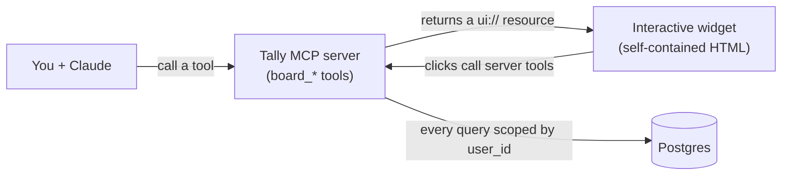

# Tally

> A personal command surface for Claude. Tally's tools return an **interactive checklist widget** that renders inline in the conversation, not just text, so you (and Claude) can create boards, check items off, reorder, and ship them without leaving the chat. Built on the official **MCP Apps** standard and backed by Postgres.

**Live MCP endpoint:** `https://tally-production-8b17.up.railway.app/mcp` · **Standard:** MCP Apps (SEP-1865) · **Stack:** TypeScript · React · Postgres · Railway

<!--
  Portfolio screenshot / GIF goes here. Drop an image in docs/media/ and use:
  
-->

## What it is

Tally is a Model Context Protocol (MCP) server built on the **MCP Apps extension** (SEP-1865, the first official standard for MCP tools that return real UI). Instead of answering with text, its tools hand Claude a self-contained widget that renders inline. Module one is a **board of checklists** with a launch flavor: create named boards, check items off across four states, watch a readiness meter fill, and "ship" a finished board. It is both a tool I use and a demonstration of building on a young standard the right way: a clean data model, explicit tool visibility, and one interactive module designed to become many.

## Highlights

- **Interactive UI in chat, not text.** Tools return a `ui://` resource: one self-contained HTML widget (all JS, CSS, and fonts inlined) that renders in Claude Desktop and claude.ai.
- **Many named boards.** General checklists ("give me a checklist for an apple pie") with a launch personality (a readiness meter, "go for launch", "ship it"). Switch boards by name, or by clicking a tab in the widget.
- **Claude and you both operate it.** Full create, read, update, delete from either side: add, edit, set status (todo / active / blocked / done), reorder by drag *or* by asking Claude to "move X to the top", reset, and ship.
- **A real completion moment.** Finishing a board archives it to a history record and clears it for the next run; the widget shows a "Go for launch" badge and a two step ship confirm.
- **Safe by construction.** Every database query is scoped to an owner, destructive actions run inside a single transaction, and the ship action is app only so the model can never empty your board by accident.

## How it works

Tally uses the MCP Apps **pull model**: a tool returns a UI resource, the widget fetches its own data by calling a server tool on mount, and every click calls another server tool. State lives in Postgres.



A **module** in Tally is a tool prefix, a `ui://` widget, its own tables, and a registry row, so a second module can be added later without touching the first.

## Stack

| Layer | Choice | Why |
|---|---|---|
| Server | TypeScript · `@modelcontextprotocol/ext-apps` on the MCP SDK · Express (streamable HTTP) | The official MCP Apps standard; a stateless transport |
| Widget | React · Vite · `vite-plugin-singlefile` | Builds to one inlined HTML file, exactly what a `ui://` resource must be |
| Data | Postgres · Drizzle ORM · Zod | Typed and SQL first; one source of truth for the shapes the tool and the widget share |
| Deploy | Railway (service + managed Postgres) | The app and its database in one place |

## Try it in Claude

Add a **custom connector** in Claude Desktop (Settings, then Connectors) pointing at:

```
https://tally-production-8b17.up.railway.app/mcp
```

Then ask Claude to *"show my board"* or *"give me a checklist for …"*.

> Note: this hosted instance has **no authentication** (single tenant by design in v1), so anyone with the URL operates the same board. It is checklists, not secrets, but treat the URL as public. To keep your own data private, run it locally or self host.

## Run it locally

Prerequisites: Node 22+ and a Postgres database (Docker is the quick path).

```bash
git clone https://github.com/Chineme-Portfolio/tally-mcp.git
cd tally-mcp
npm install
cp .env.example .env          # set DATABASE_URL and DEFAULT_USER_ID (a v4 uuid)
npm run db:migrate            # create the schema
npm run db:seed               # seed the default user + a starter board
npm run dev                   # widget build (watch) + server on :3001
```

The MCP endpoint is then `http://localhost:3001/mcp`. To reach it from Claude Desktop, front it with a tunnel (for example cloudflared) and add that URL as a connector.

## Repository layout

`src/` holds the server (`src/server`), the widget (`src/widget/board`), and the shapes both share (`src/shared`). The design system lives in `design/` (a Claude Design export). Product decisions and build history live in a small **context system** under `context/`, documented next.

---

## Context system

<!-- Lives at the REPO ROOT, the front door for anyone (or any AI agent) working in this repo. The context files themselves live in context/. -->

Read the context system before writing any code. `context/foundation.md` is the source of truth; everything else references it.

**Tally** is a personal MCP server on the MCP Apps standard: its tools return an interactive widget that renders inline in the chat client. Module one is a launch-readiness board. See `context/project-overview.md` for the plain-English tour.

### Files
- `context/foundation.md` — every locked decision, with reasoning (start here)
- `context/project-overview.md` — plain-English digest; summarizes, never decides
- `context/architecture.md` — how the pieces fit; the keystone unlock
- `context/code-standards.md` — implementation law; read top-to-bottom every session (security lives here in §8–9 — no separate `security.md` in v1)
- `context/library-docs.md` — the stack as used here + approved dependencies
- `context/build-graph.md` — dependency map (what depends on what)
- `context/progress-log.md` — living build record; add an entry after any work
- `context/ui-tokens.md` — design tokens (copper + ink, type, spacing, motion) and the layered token system
- `context/ui-rules.md` — how tokens compose into UI (voice, colour discipline, motion, interaction states)
- `context/ui-registry.md` — the component registry; check it before building any component
- `design/` — the Claude Design export: tokens, the `helm-*` component library, guidelines, and the launch-board UI kit (the design source of truth the trio points at)

### Reading order
foundation → project-overview → architecture → code-standards → library-docs → build-graph → progress-log, then the UI trio (ui-tokens → ui-rules → ui-registry).

### If you're here to…
| Need | Read |
|---|---|
| Understand what this is | `project-overview.md`, then `foundation.md` for the why |
| Write any code | `code-standards.md` (every session) |
| Build UI | the UI trio (`ui-tokens.md` · `ui-rules.md`); check `ui-registry.md` before building any component |
| Add a dependency | `library-docs.md` (and add it to the approved list first) |
| Decide what to build next | `build-graph.md` |
| See what exists already | `progress-log.md` |

### The golden rule
When a decision changes, update `foundation.md` first, then ripple the change into every file that references it. Never let two files disagree.

### Non-negotiables
The things that must never happen:

1. **No unscoped query on a per-user table.** Every `items` query filters by `user_id` from the single `resolveUserId()` source — even at one tenant (`code-standards.md` §5).
2. **No secret in the widget bundle.** The widget HTML ships to the client; treat it as public (`code-standards.md` §9).
3. **No implicit tool visibility.** Every tool sets `visibility` explicitly (`foundation.md` §7 #10–11).
4. **No module importing another module.** A module = tool-prefix + `ui://` widget + own tables + registry row (`foundation.md` §9).
5. **No feature work before the render spike passes** (`foundation.md` §7 #15).
6. **`foundation.md` wins** every conflict.
